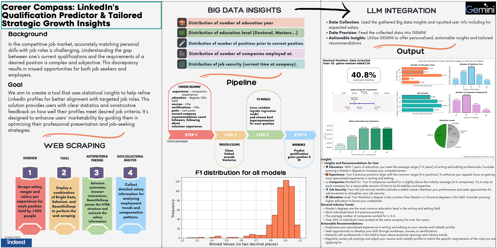
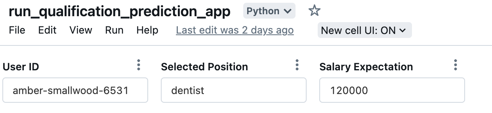
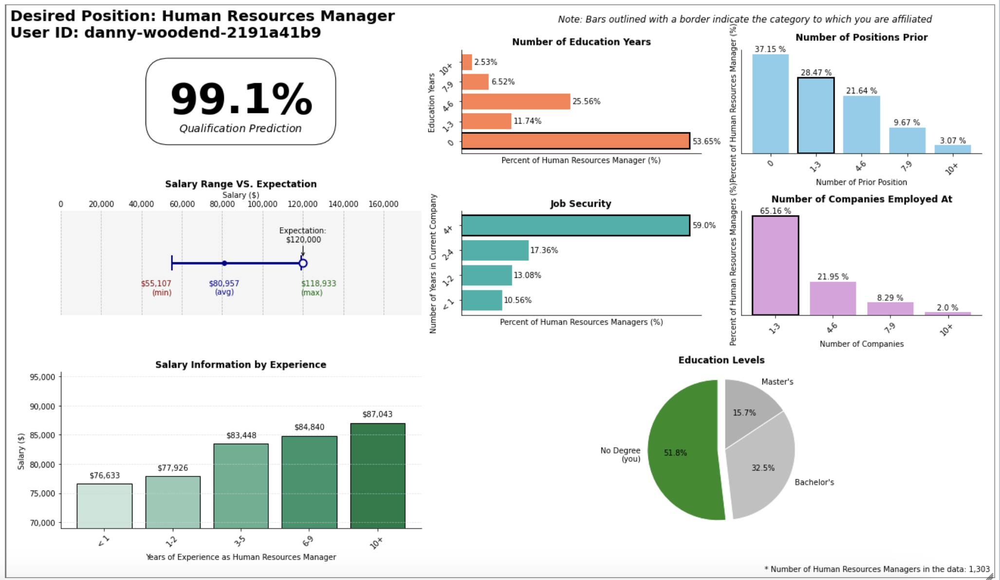

# 🚀 Career Compass: LinkedIn's Qualification Predictor & Tailored Strategic Growth Insights 

## Final Project Data Collection Lab

Submitted by:
- Hadar Sugerman
- Tomer Grinberg
- Jacob Link
- Yuval Livne

## 📝 Description
We set out on creating a tool for LinkedIn users which accurately present the user with a qualification prediction, big data insights and actionable recommendations generated by a LLM, given a desired position and their expected salary. 

## 📦 Files Uploaded 
`prediction_engine.ipynb`: Feature extraction and model creation. 
`big_data_insights_engine.ipynb`:  Statistical insights extraction.
`scrape_engine.py`:  Utilizing Bright Datas scraping infrastructure.
`positions_above_300.csv`:  Positions extracted from 'Peoples' data used as the positions we scraped from Indeed.
`position_salary.json`:  scraped data regarding salary per experience.
`min_max_salary.json`:  scraped data regarding salary range.
`scraped_salary_data.csv`:  all raw scraped data combined.

**`run_qualification_prediction_app.ipynb`:  final app notebook**

## 🏃 How To Run
Follow these steps to get the application running: 
1. Download the `run_qualification_prediction_app.ipynb` notebook.
2. Upload notebook to DataBricks environment.
3. Press the "**▶️ Run all**" button located at the top right of the page.
4. Change the input to the app, using the widgets located at the top left side of the screen: **User ID**, **Selected Position**, **Salary Expectation** and run the last cell in the notebook to see the output change based on the chosen inputs.
> 🔔 **Important Note**:
>  we assume you are running the notebook in the same Data Bricks environment allocated to us during the semester. For optimal runtime the app needs access to the dbfs storage.

## 💡 Example
 After downloading the notebook, uploading to Data Bricks environment and running all cells. Lets see how we can use the interactive widgets. 
 * Choose a **User ID** from the dropdown widget.
 * Choose a **Selected Position** from the dropdown widget.
 * Input the **Salary Expectation** to the text input widget.

Next, navigate to the final cell using the content side bar

Finally, run the last cell in the notebook to see the results.

### Result

## 📬 Contact

grtomer@campus.technion.ac.il

## 📃 License

Use wisely and enjoy the insights.

----------

We hope this tool helps you in your career,
Made with ❤️ and 🍕
